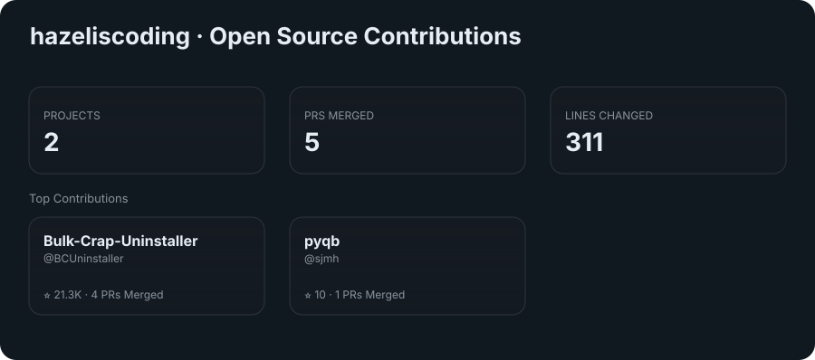

# 🌸 Hi, I'm Hazel~! (she/they) 💻

✨ Full-stack .NET developer | 🌱 Lifelong learner | 💖 Just a girl who loves clean code and comfy vibes ✨

I'm a Texas-based dev passionate about building thoughtful, scalable systems with a dash of personal flair. Whether it's crafting a beautiful frontend in Angular, designing robust APIs in C#, or deploying magic to the cloud, I take pride in writing code that *feels good*.

---

### 🧠 Core Strengths

- 💠 Backend: C#, .NET, ASP.NET MVC, Entity Framework, Dapper, SQL & NoSQL
- 🌐 Frontend: Angular, JavaScript/TypeScript, jQuery
- ☁️ Cloud: Azure, AWS, Serverless, CI/CD pipelines
- 🤖 AI Agents: MCP, agent orchestration & evals, human-in-the-loop workflows
- 🔍 Testing & Quality: XUnit, Jest, TDD
- 🧩 Architecture: Distributed Systems, Domain-Driven Design, RESTful & SOAP APIs

---

### 🌟 Currently

- 👩‍💻 Working full-time as a Full-Stack Web Developer
- 🤖 Deep-diving into AI agent infrastructure in .NET — building an enterprise [MCP gateway](https://github.com/hazeliscoding/mcp-gateway), an [agent eval & chaos-testing platform](https://github.com/hazeliscoding/agent-eval-platform), and [agent-driven incident response](https://github.com/hazeliscoding/incident-control-plane)
- 🛠️ Shipping comfy little tools on the side: [pr-sweep](https://github.com/hazeliscoding/pr-sweep) (desktop PR dashboard for sprint teams) & [mochi](https://github.com/hazeliscoding/mochi) (privacy-first web analytics)
- 🦀 Learning Rust & Golang (because why not suffer beautifully?)

---

### 🌱 Open Source

---

### 💌 Let's Connect!

---

📊 GitHub Stats

 

