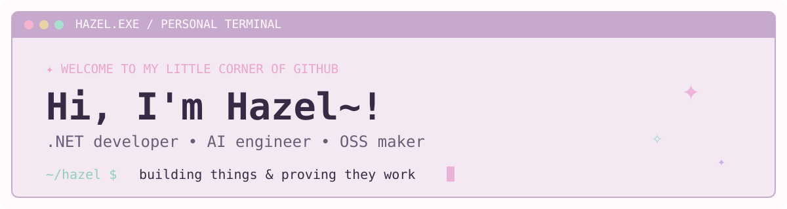
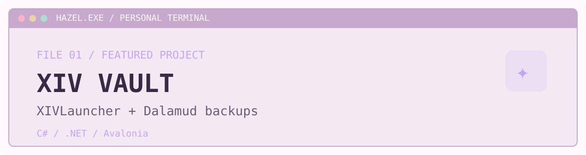
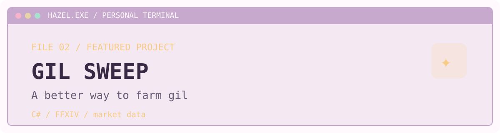
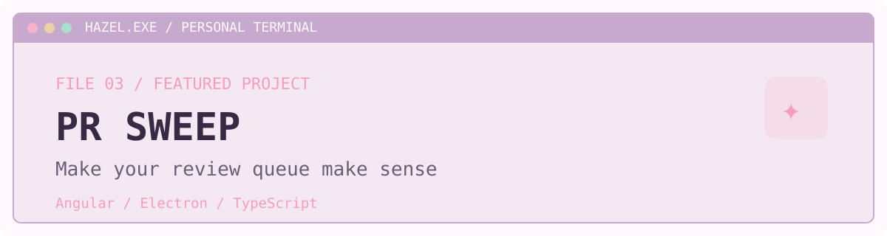
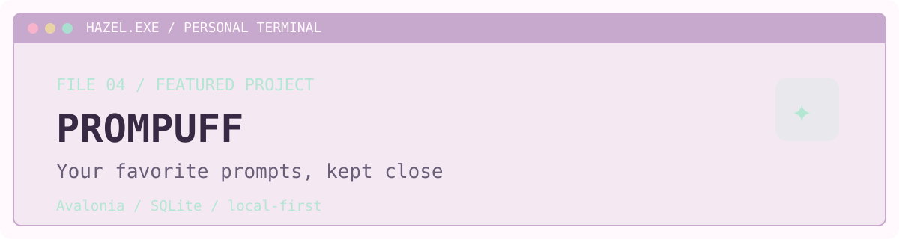
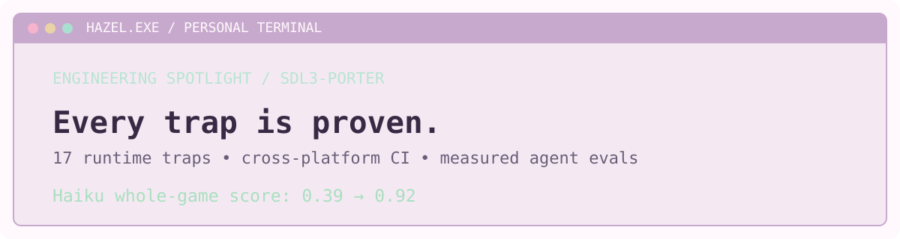
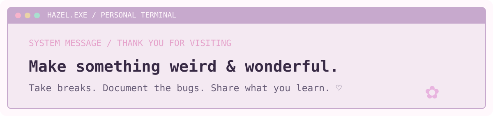

<!-- Hazel's GitHub profile: artwork authored in assets/ and generated by scripts/build_art.py -->
<picture>
  <source media="(prefers-color-scheme: dark)" srcset="./assets/header-dark.svg">
  <source media="(prefers-color-scheme: light)" srcset="./assets/header-light.svg">
  
</picture>

  <a href="https://hazeliscoding.dev">Portfolio</a> ·
  <a href="https://www.hazeliscoding.dev/blog/every-trap-is-proven">Engineering blog</a> ·
  <a href="https://www.linkedin.com/in/hazelgranados/">LinkedIn</a> ·
  <a href="mailto:hazel.granados@protonmail.com">Email</a>

### 🌸 Welcome!

I'm **Hazel (she/they)**, a Texas-based full-stack developer building with **C#, .NET, Angular, and cloud tooling**. I love local-first desktop applications, developer experience, and **AI engineering grounded in evaluation rather than vibes**.

I build useful things for hobbies and work, and I believe a good tool should be reliable, approachable, and a little bit cozy. ♡

### 🖥️ Featured software

<!-- Image cards are clickable and have accessible alt text; artwork intentionally does not claim to be a real product screenshot. -->
<a href="https://github.com/hazeliscoding/xiv-vault"><picture><source media="(prefers-color-scheme: dark)" srcset="./assets/xiv-vault-dark.svg"></picture></a>

<a href="https://github.com/hazeliscoding/gil-sweep"><picture><source media="(prefers-color-scheme: dark)" srcset="./assets/gil-sweep-dark.svg"></picture></a>

<a href="https://github.com/hazeliscoding/pr-sweep"><picture><source media="(prefers-color-scheme: dark)" srcset="./assets/pr-sweep-dark.svg"></picture></a>

<a href="https://github.com/hazeliscoding/prompuff"><picture><source media="(prefers-color-scheme: dark)" srcset="./assets/prompuff-dark.svg"></picture></a>

> Apparently, my response to a minor inconvenience is to build an entire app about it.

### 🤖 AI engineering · proving what works

<a href="https://github.com/hazeliscoding/sdl3-porter"><picture><source media="(prefers-color-scheme: dark)" srcset="./assets/sdl3-porter-dark.svg"></picture></a>

**[sdl3-porter](https://github.com/hazeliscoding/sdl3-porter)** is a Claude Code plugin for migrating C and C++ projects from SDL2 to SDL3. It catches runtime behavior changes that a compiler can miss. Each of its **17 proven traps** has a working SDL2 original, a naive SDL3 port that compiles but fails, and a corrected port. Evaluations compare agents with and without the skill, and the plugin was tested against real-world codebases including Woof! and scrcpy.

📖 **[Every trap is proven: building an agent skill you can trust](https://www.hazeliscoding.dev/blog/every-trap-is-proven)** — my write-up on regression fixtures, evaluation design, agent debugging and documenting known limitations.

Also exploring agent infrastructure through **[Axiomarium](https://github.com/hazeliscoding/axiomarium)**, an open lab for agents, skills, hooks, policies and evaluations.

### 🧠 My toolbox

| | Things I use |
|---|---|
| 💠 Applications | C#, .NET, ASP.NET, Entity Framework, Dapper, SQL, Angular, TypeScript |
| 🖥️ Desktop | Avalonia UI, Electron, SQLite, local-first applications |
| 🤖 Agents | Claude Code, GitHub Copilot, Codex, MCP, agent skills and behavioral evals |
| ☁️ Delivery | Azure, AWS, Docker, devcontainers, CI/CD, GitHub Actions |
| 🧪 Quality | xUnit, Jest, regression testing, maintainable architecture |
| 🦀 Curiosities | Rust, Go, C++, systems programming and games |

### ✨ Now playing

<!-- START:ACTIVITY -->
- 📦 Latest featured release: [prompuff v1.1.0](https://github.com/hazeliscoding/prompuff/releases/tag/v1.1.0)
- ✍️ Featured writing: [Every trap is proven](https://www.hazeliscoding.dev/blog/every-trap-is-proven)
<!-- END:ACTIVITY -->

### 🌿 Outside the terminal

FFXIV, JRPGs, anime and yuri manga, shoegaze and metal, long walks, and listening to people enthusiastically explain their latest obsession.

📊 Optional GitHub stats

<!-- Third-party stats are optional; remote images may sometimes be unavailable. -->

<picture>
  <source media="(prefers-color-scheme: dark)" srcset="./assets/footer-dark.svg">
  <source media="(prefers-color-scheme: light)" srcset="./assets/footer-light.svg">
  
</picture>
